# job4j_dreamjob

### Описание

Приложение на сервлетах и JSP, реализующее простую биржу вакансий и кандидатов. Реализована возможность добавлять/изменять данные по каждой вакансии и кандидату.

### Интерфейс

Регистрация пользователя:

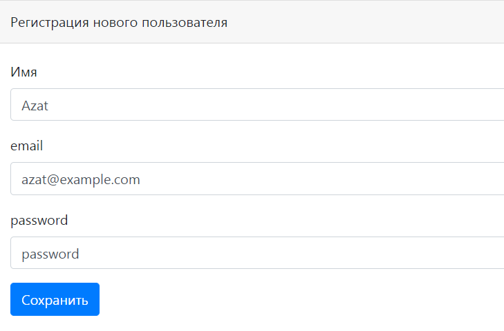

Регистрация пользователя с повторяющимся email'ом
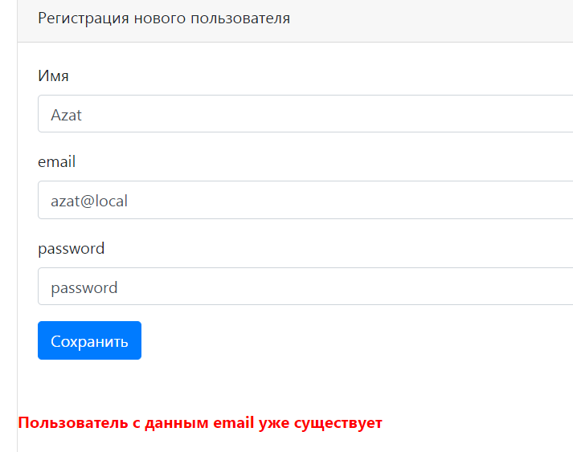
Авторизация пользователя с неправильным email'ом или паролем
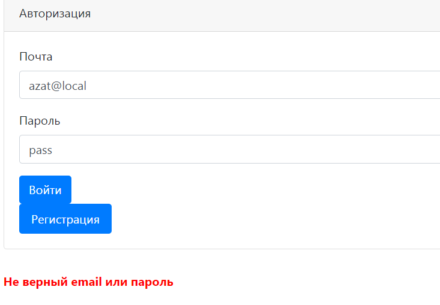
Вакансии:
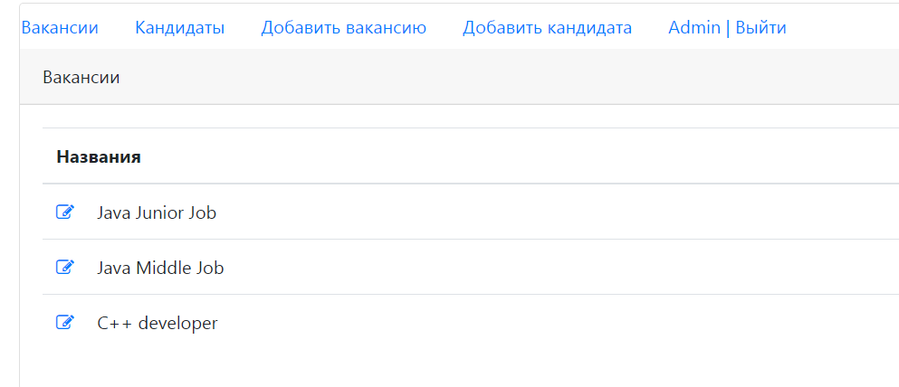
Редактирование/добавление вакансии
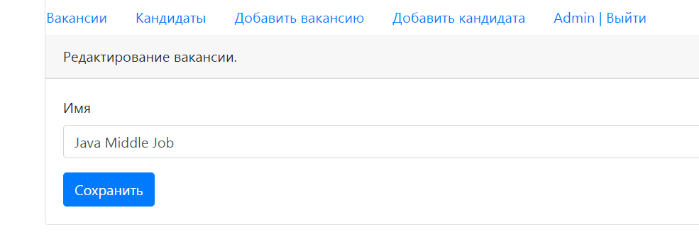

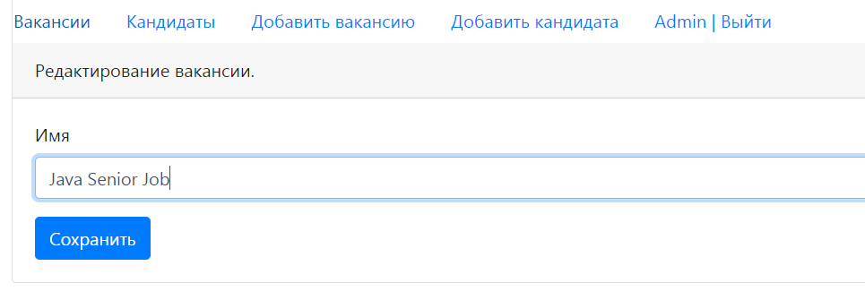

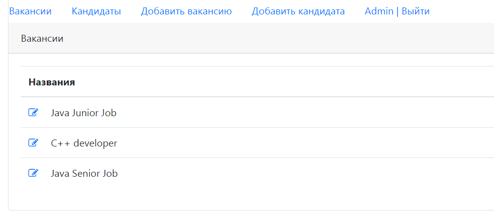
Список кандидатов:

Добавим нового кандидата
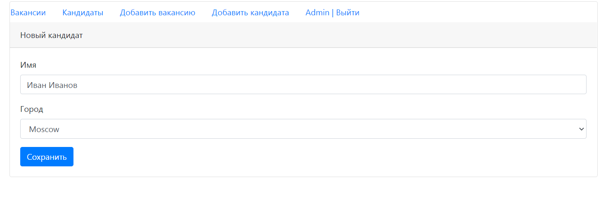

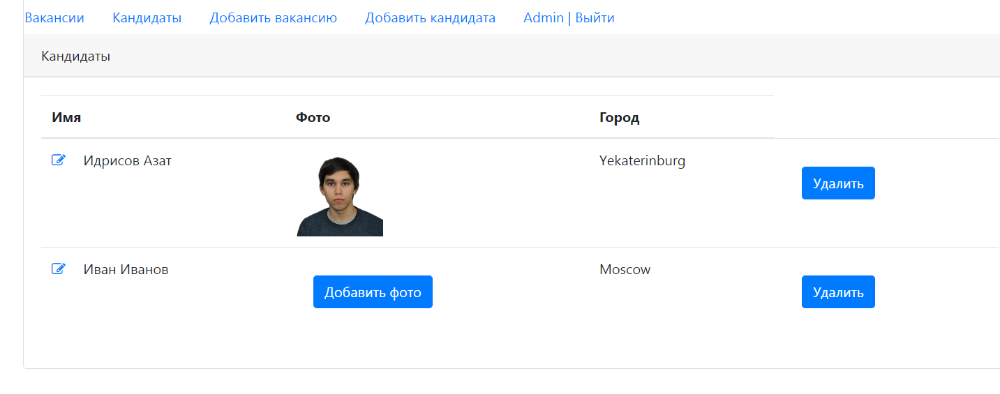
Добавим фото для нового кандидата

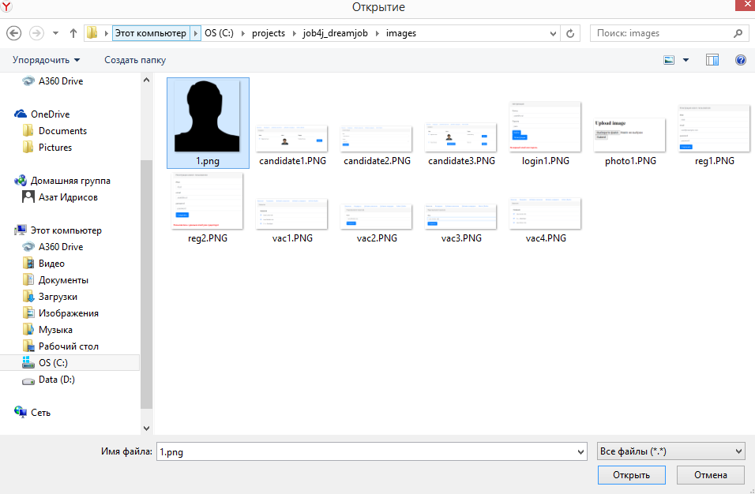

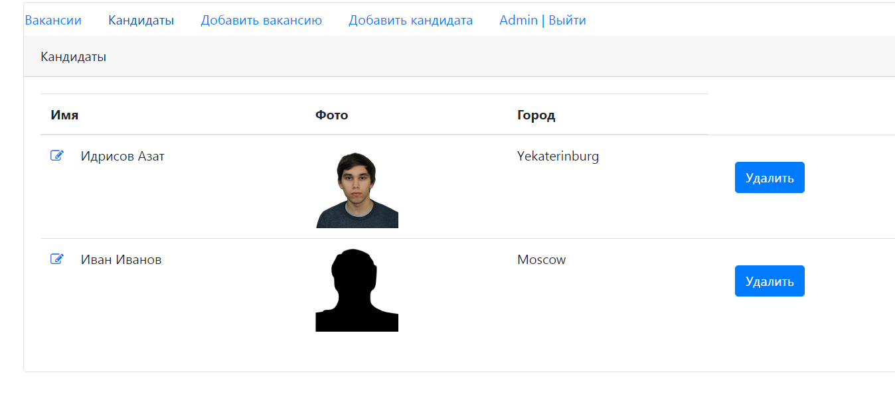