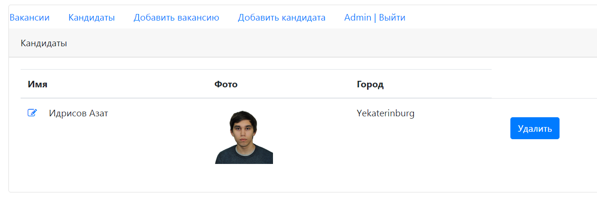
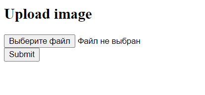

# job4j_dreamjob

## Описание

Приложение на сервлетах и JSP, реализующее простую биржу вакансий и кандидатов. Реализована возможность добавлять/изменять данные по каждой вакансии и кандидату.

## Функционал
* Регистрация пользователя
* Аутентификация на сервлет-фильтрах
* Авторизация через БД PostgreSQL
* Добавление/изменение вакансий
* Добавление/изменение соискателей
* Добавление/изменение/скачивание фотографии соискателя

## Технологии
* Java14
* JDBC
* PostgreSQL
* Servlet&JSP&JSTL
* HTML, CSS, BOOTSTRAP, JS, AJAX, JQUERY
* Junit, Mockito, Powermock
* Apache Commons Fileupload

Проект реализован по шаблону MVC и разделён на слои:

1. Модели

   1.1 [Candidate](src/main/java/ru/job4j/dream/model/Candidate.java) - кандидат  
   1.2 [Post](src/main/java/ru/job4j/dream/model/Post.java) - вакансия  
   1.3 [User](src/main/java/ru/job4j/dream/model/User.java) - пользователь систем

2. Хранилище

   2.1 [PsqlStore](src/main/java/ru/job4j/dream/store/PsqlStore.java) - PostgreSQL хранилище для вакансий, кандидатов и пользователей
   
3. JSP - View

   3.1 [index.jsp](src/main/webapp/index.jsp) - главная страница приложения.  
   3.2 [posts.jsp](src/main/webapp/post/posts.jsp) - страница, содержащая список вакансий.
   У каждой вакансии есть ссылка на редактирование   
   3.3 [post/edit.jsp](src/main/webapp/post/posts.jsp) - страница редактирования вакансии  
   3.4 [candidates.jsp](src/main/webapp/candidate/candidates.jsp) - страница с кандидатами  
   3.5 [candidate/edit.jsp](src/main/webapp/candidate/edit.jsp) - страница редактирования кандидата  
   3.6 [login.jsp](src/main/webapp/login.jsp) - страница авторизации  
   3.7 [reg.jsp](src/main/webapp/reg.jsp) - страница регистрации  
   3.8 [upload.jsp](src/main/webapp/upload.jsp) - страница загрузки фотографии кандидата  
4. Сервлеты - Controller

   4.1 [AuthServlet](src/main/java/ru/job4j/dream/servlet/AuthServlet.java) -
   Сервлет авторизации. Принимает запрос с JSP, проверяет введенные
   пользователем данных, существует ли в PostgreSQL хранилище такой пользователь. В случае успешной авторизации, добавляет
   пользователя в Http-сессию.     
   4.2 [RegServlet](src/main/java/ru/job4j/dream/servlet/RegServlet.java) -
   Сервлет регистрации. Принимает запрос с JSP, производит валидацию. В случае успешной
   регистрации добавляет нового пользователя в PostgreSQL хранилище.  
   4.3 [IndexServlet](src/main/java/ru/job4j/dream/servlet/IndexServlet.java) -
   Сервлет отвечает за отправку данных на главную страницу приложения.  
   4.4 [PostServlet](src/main/java/ru/job4j/dream/servlet/PostServlet.java) -
   Сервлет отвечает за загрузку списка всех вакансий на соответствующую JSP-страницу     
   4.5 [CandidateServlet](src/main/java/ru/job4j/dream/servlet/CandidateServlet.java) -
   Сервлет отвечает за загрузку списка всех кандидатов на соответствующую JSP-страницу  
   4.6 [DeleteCandidateServlet](src/main/java/ru/job4j/dream/servlet/DeleteCandidateServlet.java) -
   Сервлет отвечает за удаление кандидата  
   4.7 [DownloadServlet](src/main/java/ru/job4j/dream/servlet/DownloadServlet.java) -
   Сервлет отвечает за загрузку изображения на страницу, и скачивание его пользователем.      
   4.8 [UploadServlet](src/main/java/ru/job4j/dream/servlet/UploadServlet.java) -
   Сервлет отвечает за загрузку пользователем фотографии для определённого кандидата.  
   
5. Фильтры
   5.1 [AuthFilter](src/main/java/ru/job4j/dream/filter/AuthFilter.java) -
   Блокирует доступ неавторизованному пользователю ко всем страницами приложения,
   кроме страниц авторизации и регистрации.  
   5.2 [CorsFilter](src/main/java/ru/job4j/dream/filter/CORSFilter.java) -
   Cross-Origin-Resource-Sharing фильтр. Допускает междоменные запросы, когда
   клиент и сервер находятся на разных машинах.

## Интерфейс

Регистрация пользователя:

Регистрация пользователя с повторяющимся email'ом

Авторизация пользователя с неправильным email'ом или паролем

Вакансии:

Редактирование/добавление вакансии

Список кандидатов:

Добавим нового кандидата

Добавим фото для нового кандидата

